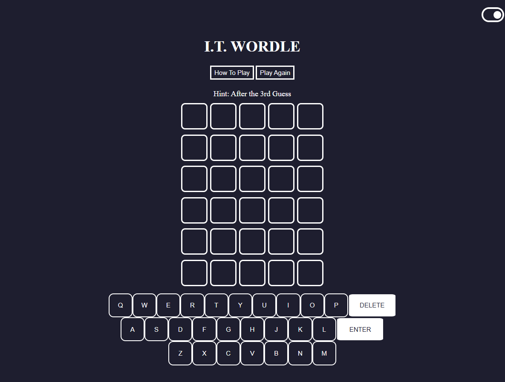

<h1>Project 1: I.T. Wordle</h1>

<h2>Game Description</h2>

The I.T. Wordle game is a word-puzzle guessing game where players need to guess the randomly selected 5-letter word by the computer within 6 guesses. The computer selects a random word from the stored word list that contains nearly 100 words related to I.T.

After each player guess, the colors of the letters from the player's guess will change to show how close the player is to the hidden word. 

 

<b>Green:</b> The letter is in the word and is in the right spot.

<b>Yellow:</b> The letter is in the word but is <i><b>NOT</b></i> in the right spot.

<b>Gray:</b> The letter is <i><b>NOT</b></i> in the word.

 

Also, the game includes a hint that is available after the third guess to make it easier for the player to guess the selected game.

Here is the link to the <i><a href="https://buali03.github.io/Wordle-Game/">I.T. Wordle Game</a></i>.

Please try out the game and have fun! 

<h2>References</h2>

<b>CSS</b>

<ul>
<li><a href="https://www.w3schools.com/howto/howto_css_switch.asp">Page theme switch button</li>
<li><a href="https://getbootstrap.com/docs/4.0/components/modal/">Modal bootstrap</li>
</ul>
